# KYMail Architecture

## Overview

A modular email client system built with Python 3.10+ that implements a microservice-like architecture with clear separation of concerns. The system follows a pipeline flow: **Identity → Ingest → Message → Analyzer**, where each component is independently developed and communicates through well-defined protocols.

## Architecture

The system consists of five core modules:

- **Interface**: Protocol definitions and contracts
- **Identity**: OAuth authentication and token management
- **Ingest**: Email fetching and parsing from local sources
- **Message**: Email message representation and manipulation
- **Analyzer**: Semantic analysis and metadata extraction

## Project Structure

```
.
├── src/
│   ├── interface/          # Protocol definitions
│   ├── identity/           # OAuth authentication
│   ├── ingest/             # Email fetching/parsing
│   ├── message/            # Message representation
│   └── analyzer/           # Email analysis
├── tests/
│   ├── integration/        # Integration tests
│   └── e2e/               # End-to-end tests
├── docs/                   # Documentation
├── .circleci/             # CI/CD configuration
└── pyproject.toml         # Project configuration
```


## Flow Diagram

```mermaid
graph TD
    %% Interface Layer (Protocol Definitions)
    subgraph "Interface Module"
        IP[Protocol Definitions]
        IP_OAuth[OAuthHandler Protocol]
        IP_Token[TokenManager Protocol]
        IP_Ingest[Ingestor Protocol]
        IP_Message[Message Protocol]
        IP_Analyzer[Analyzer Protocol]
    end

    %% Core Pipeline Flow
    subgraph "Pipeline Flow: Identity → Ingest → Message → Analyzer"
        
        %% Identity Component
        subgraph "Identity Module"
            ID[IdentityManager]
            OAuth[GmailOAuthHandler]
            Token[SimpleTokenManager]
            
            ID --> OAuth
            ID --> Token
        end
        
        %% Ingest Component
        subgraph "Ingest Module"
            ING[LocalIngestor]
            EmailMsg[EmailMessage]
            EmailAtt[EmailAttachment]
            
            ING --> EmailMsg
            ING --> EmailAtt
        end
        
        %% Message Component
        subgraph "Message Module"
            MSG[create_message Factory]
            SimpleMsg[SimpleMessage]
            SimpleAtt[SimpleAttachment]
            
            MSG --> SimpleMsg
            MSG --> SimpleAtt
        end
        
        %% Analyzer Component
        subgraph "Analyzer Module"
            ANA[EmailAnalyzer]
            Result[EmailAnalysisResult]
            
            ANA --> Result
        end
    end

    %% External Dependencies
    Gmail[Gmail OAuth API]
    MailDir[Local Maildir Files]
    
    %% Data Flow
    Gmail -.->|OAuth Tokens| ID
    ID -->|Authentication| ING
    MailDir -.->|Email Files| ING
    ING -->|Raw Email Data| MSG
    MSG -->|Standardized Messages| ANA
    
    %% Protocol Implementation
    IP_OAuth -.->|implements| OAuth
    IP_Token -.->|implements| Token
    IP_Ingest -.->|implements| ING
    IP_Message -.->|implements| SimpleMsg
    IP_Analyzer -.->|implements| ANA
    
    %% Styling
    classDef interfaceStyle fill:#e1f5fe,stroke:#01579b,stroke-width:2px
    classDef identityStyle fill:#fff3e0,stroke:#e65100,stroke-width:2px
    classDef ingestStyle fill:#f3e5f5,stroke:#4a148c,stroke-width:2px
    classDef messageStyle fill:#e8f5e8,stroke:#1b5e20,stroke-width:2px
    classDef analyzerStyle fill:#fff8e1,stroke:#ff6f00,stroke-width:2px
    classDef externalStyle fill:#fafafa,stroke:#616161,stroke-width:2px,stroke-dasharray: 5 5
    
    class IP,IP_OAuth,IP_Token,IP_Ingest,IP_Message,IP_Analyzer interfaceStyle
    class ID,OAuth,Token identityStyle
    class ING,EmailMsg,EmailAtt ingestStyle
    class MSG,SimpleMsg,SimpleAtt messageStyle
    class ANA,Result analyzerStyle
    class Gmail,MailDir externalStyle
```



## Features

### Core Functionality
- **Modular design**: Each component can be developed and tested independently
- **Protocol-based interfaces**: Type-safe contracts between modules
- **OAuth 2.0 authentication**: Gmail integration with token management
- **Local email ingestion**: Maildir format support
- **Message standardization**: Uniform message representation
- **Email analysis**: Sentiment analysis, topic extraction, entity recognition

### Authentication Features
- Gmail OAuth 2.0 flow
- Automatic token refresh
- Secure token storage
- Authentication state management

### Message Processing
- Support for multipart emails
- Attachment handling with various content types
- Read/unread status tracking
- Email search across subjects and bodies
- Folder-based organization

### Analysis Capabilities
- Sentiment analysis with confidence scoring
- Topic and entity extraction
- Text summarization
- Conversation thread analysis
- Aggregate insights generation

## API Reference

### Interface Module

The interface module defines all protocols that other modules must implement:

- **Message Protocol**: Email message representation
- **Attachment Protocol**: Email attachment handling
- **Ingestor Protocol**: Email fetching and searching
- **Analyzer Protocol**: Email analysis capabilities
- **OAuth/Token Protocols**: Authentication management

### Factory Functions

Each module provides factory functions for easy instantiation:

- `create_identity_manager()`: Create authentication manager
- `get_ingestor()`: Create email ingestor
- `create_message()`: Create standardized message
- `EmailAnalyzer()`: Create email analyzer

## Directory Structure for Local Email

The ingestor expects a maildir-style directory structure:

```
~/mail/
├── INBOX/
│   ├── message1.eml
│   └── message2.eml
├── Sent/
│   └── sent1.eml
└── Drafts/
    └── draft1.eml
```

## Module Documentation

For detailed documentation of each module:

- **Interface Module** - Protocol definitions
- **Identity Module** - OAuth authentication
- **Ingest Module** - Email fetching
- **Message Module** - Message representation
- **Analyzer Module** - Email analysis